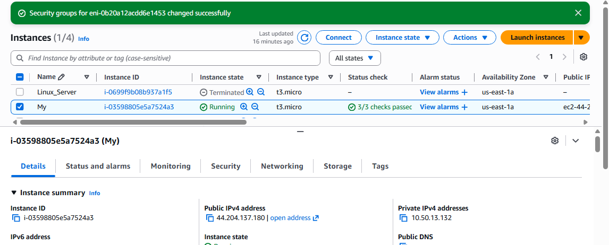

# AWS Infrastructure: Immutable Web Server via Custom AMI

## 1. Project Objective
This project demonstrates the "Golden Image" strategy in AWS. By creating a custom Amazon Machine Image (AMI), I moved from manual, error-prone server configuration to a consistent, automated deployment model.

## 2. Technical Workflow

### Phase 1: Environment Setup
* **Base OS**: Ubuntu 24.04 LTS.
* **Stack**: Installed and enabled Apache2.
* **Hardening**: Updated system packages and configured the web root to ensure immediate service availability upon boot.

### Phase 2: Security & Networking
I configured a dedicated **Security Group** to manage traffic:
* **HTTP (Port 80)**: Open to `0.0.0.0/0` for public web access.
* **SSH (Port 22)**: Open for administrative management.

### Phase 3: AMI Snapshot & Validation
* **AMI Creation**: Created `Ubuntu-Web-Server-V1` from the configured instance to preserve the state.
* **Deployment**: Launched a new `t3.micro` instance using the custom AMI.

## 3. Evidence of Success

### Console Verification
The AWS Console confirms the instance is **Running** and launched from the custom image.

### Live Web Result
The public IPv4 address (`44.204.137.180`) successfully serves the Apache default page, proving the AMI correctly preserved the web server configuration.

## 4. Conclusion
This implementation ensures that every new server added to the infrastructure is a bit-for-bit clone of the "Golden Image," enabling rapid scaling and high reliability.

---
**Next Steps**: 
- Implement **Auto Scaling Groups** using this AMI.
- Automate image updates using **HashiCorp Packer**.
